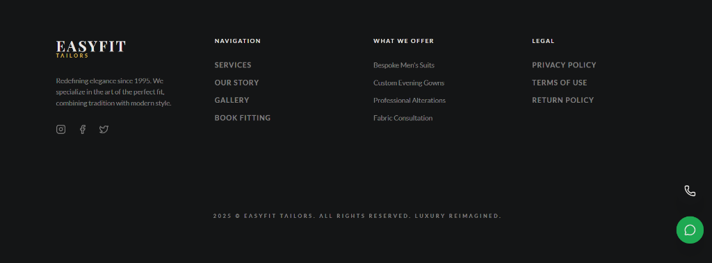
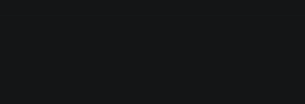
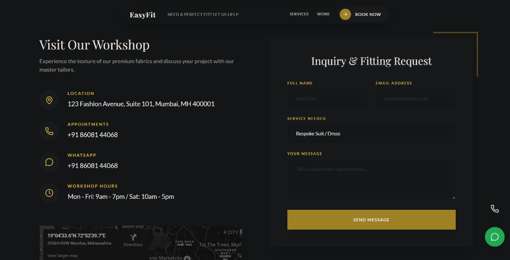
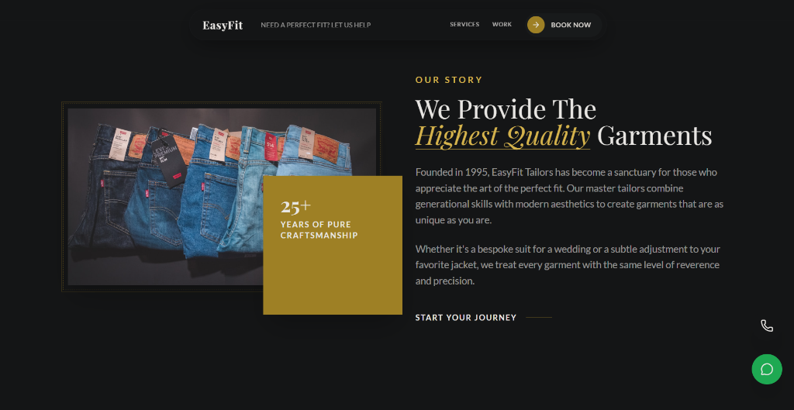
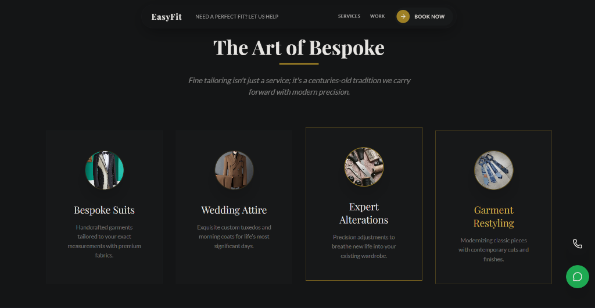

# EasyFit Tailors Landing Page

**EasyFit Tailors Landing Page** is a responsive, professional landing page built for tailors and custom clothing shops to attract visitors and showcase services.

🌐 Live Demo: https://easyfit-tailors.netlify.app/

---

## 🧠 Overview

This landing page provides a clean, modern UI with sections for services, portfolio/gallery, testimonials, FAQ, and a contact form. It’s designed to be easy to customise and deploy quickly.

---

## 🛠️ Tech Stack

The project uses the following technologies:

- **HTML5** – Structure of the web pages
- **CSS3** – Styling and layout
- **JavaScript** – Interactive elements (gallery, FAQ accordion)
- **Netlify** – Hosting platform
- *Optional:* Formspree for working contact form integration

---

## 📦 Features

- Hero banner with calls-to-action
- Services overview
- Image gallery with lightbox
- FAQ accordion
- Testimonials section
- Contact form (Formspree support)
- Fully responsive layout

---

## 🚀 Installation & How to Run Locally

1. Clone the repo:

   ```bash
   git clone https://github.com/Prasann62/shop.git
   ```

2. Open the project:

   - Navigate into the project folder
   - Double-click `index.html`
   - Or open it in a browser (Chrome/Firefox/Edge)

3. (Optional) If you want the contact form to work:

   - Go to https://formspree.io/ and create a new form
   - Replace the `action` attribute in the `<form>` tag with your Formspree URL

---

## 🚧 Usage

Simply host the site on any static host (Netlify, Vercel, GitHub Pages, Surge, etc.) or share it as your portfolio project to show frontend skills.

---

## 📸 Screenshots

|   |   |
|---|---|
|  |  |
|  |  |
|  | |

---

## 📄 License

This project is licensed under the MIT License — feel free to use it in your own projects.

---

## 📫 Contact

Built by Prasann62 — if you want to reach out:

- GitHub: https://github.com/Prasann62
- Live site: https://easyfit-tailors.netlify.app/
